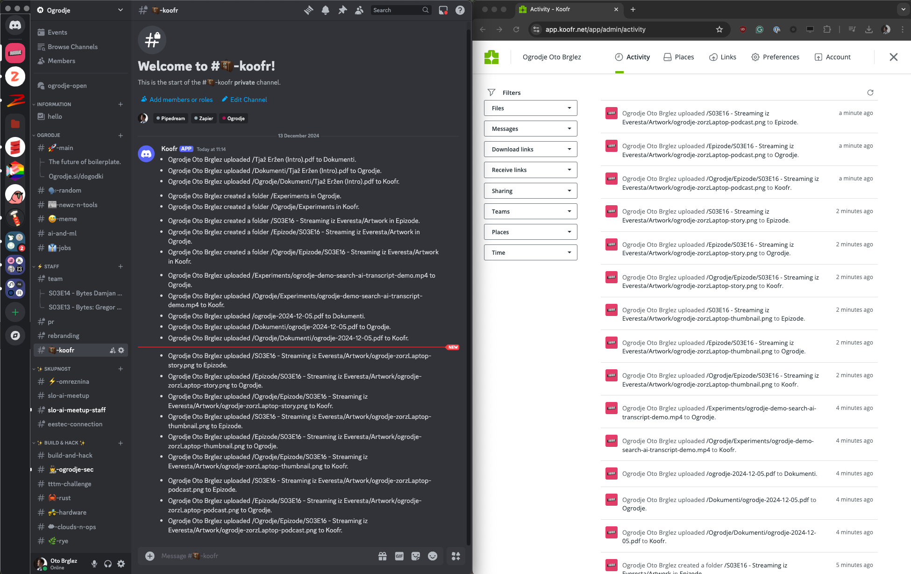

# koofr-watch [](https://github.com/otobrglez/koofr-watch/actions/workflows/build.yml)

[koofr-watch][koofr-watch] observes your [Koofr](https://koofr.eu/) storage/activities and emits changes to webhooks
making the integration with other services and processes a breeze!

Koofr [API Documentation is here](https://stage.koofr.net/developers/api).

## Demo w/ Discord



## Running with Docker 🐬

```sh
docker pull ghcr.io/otobrglez/koofr-watch:latest
docker run -ti --rm \
  -e PORT=4447 \
  -e KOOFR_USERNAME=$KOOFR_USERNAME \
  -e KOOFR_PASSWORD=$KOOFR_PASSWORD \
  -e WEBHOOK_URL_1=https://discord.com/api/webhooks/123 \
  ghcr.io/otobrglez/koofr-watch
```

## Development

Get your application
password [here](https://koofr.eu/help/linking-koofr-with-desktops/how-to-generate-an-application-specific-password-in-koofr/).

```bash
export KOOFR_PASSWORD="<your_koofer_password>" 
export KOOFR_USERNAME="<your_koofer_username>"
export PORT=4447
export WEBHOOK_URL_1=https://discord.com/api/webhooks/123.....
export WEBHOOK_URL_2=https://discord.com/api/webhooks/456.....
export WEBHOOK_URL_3=https://discord.com/api/webhooks/768..... # Five of them are supported....

sbt run
```

## Observability

The service will expose metrics in Prometheus format at [
`http://localhost:4447/metrics`](http://localhost:4447/metrics).

The `PORT` is configured via environment variable.

## Stay In Touch

- [Oto Brglez](https://github.com/otobrglez)

## License

[MIT](https://opensource.org/licenses/MIT)

[koofr-watch]: https://github.com/otobrglez/koofr-watch

[java-koofr]: https://github.com/koofr/java-koofr

P.s.: This product is not associated with the Koofr organisation and was built by reverse-engineering [java-koofr] Java
SDK.
